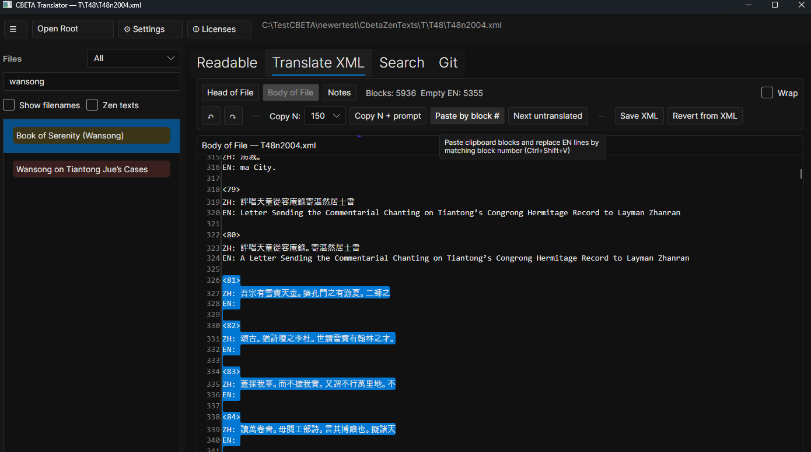

# CBETA Translator
*A fast desktop app for reading, translating, and contributing CBETA texts*

> Read. Translate. Annotate. Search. Commit.  
> Built for real work.

---

## What this is

**CBETA Translator** is a cross-platform desktop app (Windows / Linux / macOS) for working with CBETA texts, especially Zen material.

It is built for people who want to:

- read Chinese and English side by side
- translate in a human-friendly editor
- use machine translation and then clean it up
- add footnotes/notes
- search a large local text collection
- send changes to GitHub without living in the terminal

---

## Important: CBETA is non-commercial

This app is MIT-licensed, but the **CBETA texts and derived translations are non-commercial**.

If you share CBETA files or translations:

- keep the original CBETA header
- do not use them commercially

---

## Main library view (left pane)


Pick a root folder like this:

```text
root/
  xml-p5/    (original Chinese files)
  xml-p5t/   (translated files)
```

The app will automatically:

- scan the texts
- match originals and translations
- track translation progress
- cache data for speed

You can quickly narrow things down with:

- search
- filters
- grouping options
- translation status filters

### Translation status colors

- 🔴 Red = not translated
- 🟡 Yellow = partially translated
- 🟢 Green = fully translated

---

## Readable view (side-by-side reading + notes)


The **Readable** view shows:

- **Left:** Chinese
- **Right:** English translation

If a translation does not exist yet, you’ll see Chinese on both sides.

### Linked reading (both sides stay in sync)

When you click or select text on one side, the matching part on the other side is highlighted.

This makes it much easier to:

- compare lines
- review translations
- spot mistakes fast

### Hover dictionary (CC-CEDICT)

Hover over Chinese text and a dictionary popup appears (powered by **CC-CEDICT**).

Useful for:

- quick word checks
- difficult phrases
- sanity-checking draft translations

### Community footnotes

You can add community notes directly into the translated text, and they show up like normal footnotes in the readable view.

Example note format:

```xml
<note type="community" resp="optional">Text</note>
```

Nice community habit idea: if you submit a translation, add a short footnote near the beginning saying what method you used (manual, AI-assisted, which model/tool, how heavily edited, etc.). That makes review easier for everyone.

---

## Translation view (for real translation work)



There is one main translation editing view, and it is built for actual work:

- human translation
- machine translation cleanup
- preserving the file structure as much as possible
- avoiding accidental breakage

When you save, the app automatically:

- writes the file
- refreshes the rendered view
- updates caches
- recalculates translation status

This is the core workflow of the app.

---

## Advanced search (whole corpus)


There is a built-in advanced search for the whole corpus:

- full-text search
- file matches
- quick open
- basic corpus stats

First-time indexing can take a bit (big corpus), but after that it is very fast.

---

## Git tab (send changes without terminal pain)


The Git tab is there so normal people can contribute without learning command-line Git.

It can help you:

- download the project files to your computer
- update your local copy
- save your changes with a message
- upload your changes
- submit to the community repository on Github (This is called a pull request. I get to review it before it ends up public)
- recover from local messes with a **Don’t Panic** button

### Git and GitHub account required

To use this app, you need **Git installed** (the app uses Git to download and update the files).  
If you want to **submit translations**, you also need a **GitHub account**.

- **Install Git:** https://git-scm.com/downloads  
- **Create a GitHub account:** https://github.com/signup

#### Quick install help

- **Windows:** Download **Git for Windows** here: https://git-scm.com/download/win  
- **macOS:** Download Git here: https://git-scm.com/download/mac  
  (or install Apple’s command line tools by opening Terminal and running `xcode-select --install`)
- **Linux:** Download/install info here: https://git-scm.com/download/linux  
  (usually you install it with your package manager, like `apt`, `dnf`, or `pacman`)

> **Windows note:** the app now includes a **bundled Git version** (experimental), so it may work even if Git is not installed system-wide.  
> **Still recommended:** install Git normally anyway.

### Linux note (Git login)

On Linux, upload/PR can fail if Git cannot open a login prompt from inside the app.

Recommended fix: install **Git Credential Manager**.

**Ubuntu / Debian**
```bash
sudo apt-get update && sudo apt-get install -y git-credential-manager
```

**Fedora**
```bash
sudo dnf install git-credential-manager
```

**Arch**
```bash
sudo pacman -S git-credential-manager
```

---

## Performance (why it stays fast)

This app is built for big text collections and uses caching so it doesn’t re-scan or re-render everything every time.

If it gets slow, that is a bug.

Come yell at me on the /r/zen reddit forums.

---

## Platform support

- Windows
- Linux
- macOS

Built with **Avalonia 11** on **.NET 8**.

---

## Contributing

Pull requests are welcome.

Main rules:

- don’t break features
- don’t break file structure
- don’t add automatic “cleanup” that rewrites tags
- don’t make it slower without a good reason

If you’re unsure, open an issue first.

---

## Legal

CBETA Translator is licensed under the **MIT License**.

Other data/licenses:

- **CBETA corpus**: CBETA terms (non-commercial)
- **CC-CEDICT**: **CC BY-SA 4.0**

See `THIRD_PARTY_NOTICES.txt` for details.

---

## Building

If you just want to use it, grab a release.

### Windows (self-contained)
```bash
dotnet publish -c Release -r win-x64 --self-contained true /p:PublishSingleFile=true
```

### Linux (self-contained)
```bash
./eng/build-linux.sh Release true linux-x64
./run-cbeta-selfcontained.sh linux-x64
```

### macOS (Intel)
```bash
dotnet publish -c Release -r osx-x64 --self-contained true /p:PublishSingleFile=true
```

### macOS (Apple Silicon)
```bash
dotnet publish -c Release -r osx-arm64 --self-contained true /p:PublishSingleFile=true
```

### Dictionary asset required

Make sure this file exists in the publish output:

```text
Assets/Dict/cedict_ts.u8
```

If it is missing, copy it manually.

---

## Final words

CBETA Translator is a practical tool for real translation work:

- read side by side
- translate and clean machine output
- add footnotes
- search the corpus
- send changes to GitHub

Built for /r/zen by dota2nub.

🦇 Welcome to the canon.
