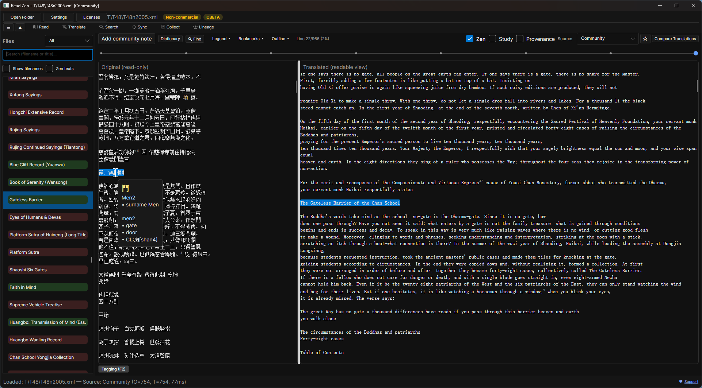
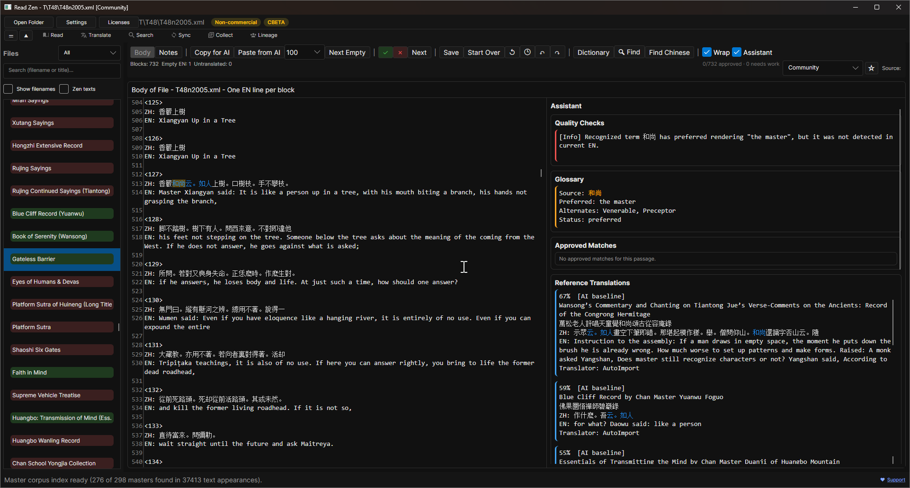
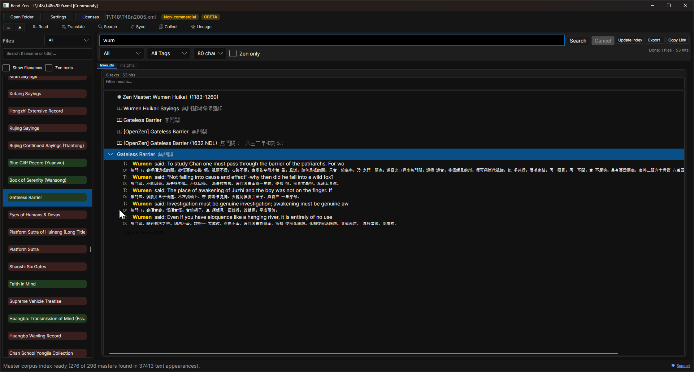
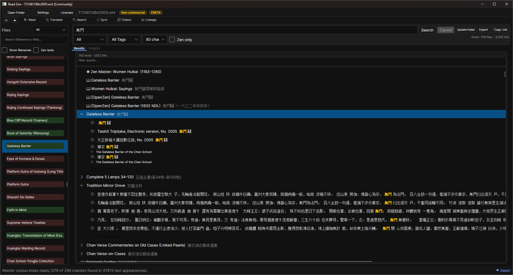
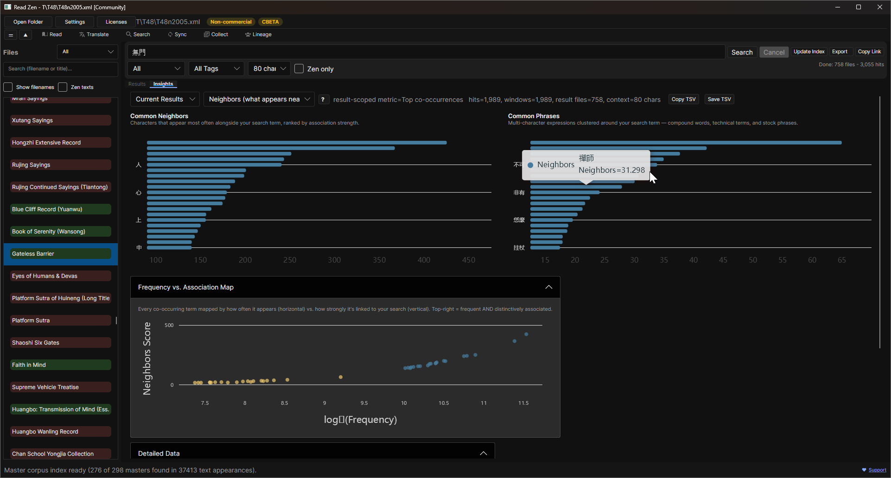
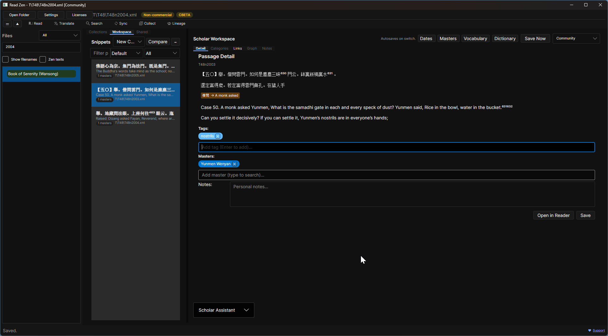
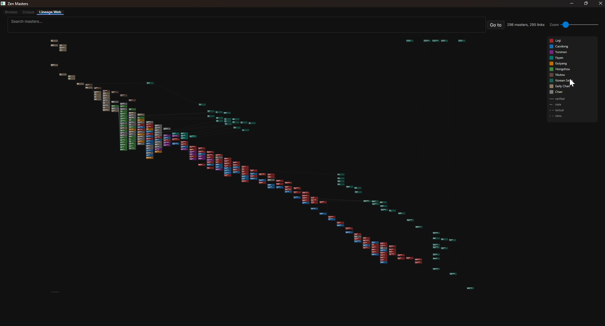
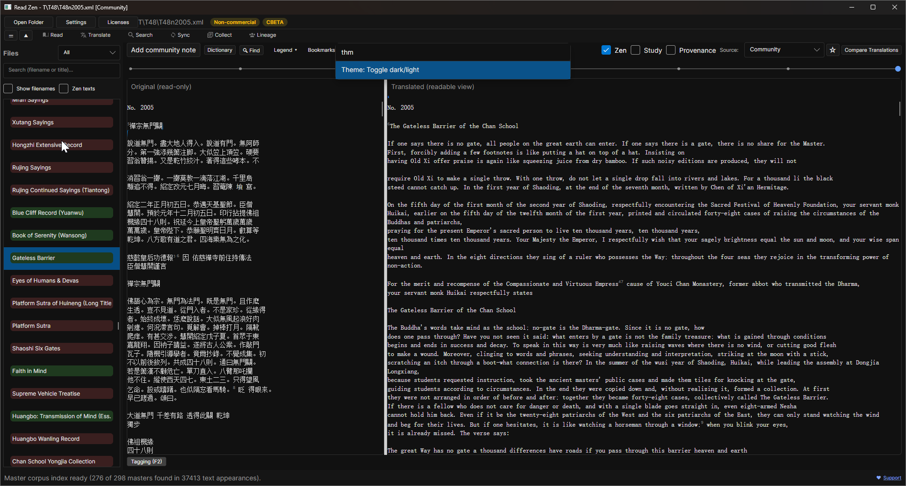

[](https://ko-fi.com/readzen)

# Read Zen

A desktop + web environment for reading, translating, searching, and researching Chinese Zen texts across **~5000 CBETA texts** and a growing **OpenZen** freely-licensed corpus.

**[Try it now - readzen.pages.dev](https://readzen.pages.dev)** | **[Download desktop app](https://github.com/Fabulu/ReadZen/releases/latest)** | **[Support on Ko-fi](https://ko-fi.com/readzen)**



Read Zen is a full working environment for Chinese Zen study and translation across both the CBETA corpus (non-commercial, ~5000 texts) and the OpenZen collection (commercial-OK, freely-licensed witnesses with full provenance tracking):

- **Read and search on the web** at [readzen.pages.dev](https://readzen.pages.dev) - no install needed
- **Read side by side** with hover dictionary, provenance, and license visibility
- **Translate** with structure-aware tools and AI-assisted workflows
- **Search** with bilingual context, analytics, and exports
- **Collect** Scholar passages with linking, comparison, and BibTeX export
- **Explore** 301 Zen masters with interactive lineage graph and corpus text appearances
- **Manage** terminology, master metadata, notes, reviews, and tags
- **Sync** personal and shared work without living in Git

### Why Read Zen?

| | What | Where |
|---|---|---|
| **Read** | Side-by-side Chinese / English with hover dictionary | Desktop + Web |
| **Search** | Full-corpus bilingual search with analytics and typeahead | Desktop + Web |
| **Explore** | 301 Zen master profiles with interactive lineage graph | Desktop + Web |
| **Translate** | Structure-aware editor with AI workflow, TM, and review | Desktop |
| **Research** | Scholar collections, passage linking, BibTeX export | Desktop |
| **Annotate** | Qualitative coding/tagging with frequency and co-occurrence analytics | Desktop |
| **Collaborate** | GitHub-backed sync for translations, termbases, collections, and reviews | Desktop |
| **Provenance** | Critical edition viewer with witness comparison and editorial documentation | Desktop |

### Try it now

| | | |
|:---:|:---:|:---:|
| [**Read the Gateless Barrier**](https://readzen.pages.dev/T48n2005) | [**Compare the 1632 Woodblock**](https://readzen.pages.dev/pd.wumenguan-1632) | [**Explore Linji's Lineage**](https://readzen.pages.dev/master/Linji_Yixuan) |
| Side-by-side *Wumenguan* with hover dictionary and Zen master links | The 1632 NDL woodblock reading edition - provenance, license, and witness text | Profile, corpus mentions, and teacher/student connections across 301 masters |

### From witness to working translation

This is the workflow Read Zen is built for - not just reading, but producing and sharing serious text work:

1. **Find a witness** - locate a freely-licensed woodblock scan or digital text in the [witness collection](https://github.com/Fabulu/woodblockeditionprocess)
2. **Verify provenance** - check source, license, SHA-256 hash, and editorial documentation in the Provenance panel
3. **Read side by side** - Chinese and English with hover dictionary, linked selection, and bookmarks
4. **Compare witnesses** - view variant readings across editions in the Witness Comparison viewer
5. **Translate safely** - block-by-block structure-aware editor with AI copy/paste, termbase, and translation memory
6. **Annotate and tag** - qualitative coding with frequency analytics and co-occurrence matrices
7. **Collect and cite** - build Scholar collections with passage linking, comparison, and BibTeX/CSL-JSON export
8. **Share and sync** - push translations, termbases, and collections via GitHub; share web links that work for everyone

### How Read Zen differs from text aggregators

| Need | General aggregators | Read Zen |
|------|---------------------|----------|
| Browse many texts | Very strong (multi-tradition, multi-language) | Focused on Chinese Chan/Zen (~5000 CBETA + OpenZen) |
| Read bilingual online | Strong | Strong, with desktop handoff and hover dictionary |
| Translate texts | Usually view-only | Structure-safe translation editor with TM and review |
| Preserve TEI/XML structure | Not the main focus | Core design principle - XML never silently mangled |
| Compare source witnesses | Usually unavailable | Provenance-tracked witness comparison with apparatus |
| Use commercially-safe editions | Mixed or unclear licensing | OpenZen: per-file CC0/CC BY-SA, separated from CBETA |
| Build research notebooks | General annotations | Scholar collections with links, tags, and export |
| Study Chan lineage | Broad knowledge graphs | 301-master Chan/Zen-focused database with corpus search |
| Do long-form translation work | Not the main product | Desktop workbench built for it |

### OpenZen: a provenance-first freely-licensed corpus

OpenZen is not just another corpus. It is a provenance-first, license-clear path for creating, translating, and reusing Chinese Zen editions without inheriting CBETA's non-commercial restrictions. Each text carries:

- Per-file SPDX license declaration (CC0, CC BY-SA) in the TEI header
- Source witness attribution with SHA-256 audit trail
- Editorial documentation and process logs
- Complete separation from CBETA so licenses never cross-contaminate

For publishers, translators, teachers, app developers, and practitioners who need commercial-safe texts with verifiable provenance, OpenZen is the path.

### Built for corpus integrity

| | |
|---|---|
| **1,199 automated tests** | URI parsing, search, translation status, corpus detection, Scholar exports, witness loading, master corpus search |
| **Structure-preserving editor** | Translation changes never break TEI validity - unsafe states are rejected, not silently mangled |
| **Separate repositories** | Originals and translations in different repos; CBETA and OpenZen in different repos |
| **Local-first work model** | All text work happens on your machine; sync is explicit and reversible |
| **Provenance manifests** | Source witness hashes, capture dates, vetting confidence, editorial actor logs |
| **Recovery actions** | Sync problems have escape hatches; destructive actions require confirmation |

## Download & Install

Read Zen ships as self-contained binaries - no .NET runtime install needed.

### Get it

Latest release: **[github.com/Fabulu/ReadZen/releases/latest](https://github.com/Fabulu/ReadZen/releases/latest)**

| OS | Artifact | Notes |
|---|---|---|
| Windows | `ReadZen-win-x64-vX.Y.Z.zip` | Extract anywhere, run `ReadZen.App.exe`. SmartScreen warning expected on first launch (see below). |
| Linux | `ReadZen-linux-x64-vX.Y.Z.tar.gz` | Extract, `chmod +x ReadZen.App`, run. |
| macOS (Apple Silicon) | `ReadZen-osx-arm64-vX.Y.Z.zip` | Extract, may need to allow in System Settings → Privacy & Security on first launch. |
| macOS (Intel) | `ReadZen-osx-x64-vX.Y.Z.zip` | Same as Apple Silicon. |

Windows installer builds include in-app auto-update via Velopack - the app checks GitHub Releases on launch and can update in place. Zip and Linux/macOS builds show a notification banner with a download link when a newer release is available.

### Windows users: `winget install ReadZen`

Once the manifest is live in microsoft/winget-pkgs (see `docs/WINGET_SETUP.md` for bootstrap status), you can install and update Read Zen through WinGet instead of the zip:

```powershell
winget install Fabulu.ReadZen
```

Microsoft serves the binary from its CDN, so there's no SmartScreen warning. `winget upgrade Fabulu.ReadZen` picks up new releases automatically - the CI workflow PRs an updated manifest on every GitHub release.

### Known friction (and why)

Read Zen is a small open-source project without commercial signing certificates. That means three things you should expect on first launch (unless you install via WinGet, which bypasses Windows SmartScreen entirely):

- **Windows SmartScreen warning** - "Windows protected your PC". Click **More info → Run anyway**. We don't pay Microsoft $120/yr for an Azure Trusted Signing certificate. The source is at [Fabulu/ReadZen](https://github.com/Fabulu/ReadZen) - verify if you want. *Or skip all of this with `winget install Fabulu.ReadZen`.*
- **macOS Gatekeeper block** - "Read Zen.app cannot be opened because the developer cannot be verified." On macOS 14: right-click the app → **Open**. On macOS 15+: System Settings → **Privacy & Security** → scroll to "Read Zen was blocked" → **Open Anyway**.
- **Linux** - no signing involved, but you'll need to `chmod +x` the binary the first time.

### Prerequisites for full functionality

- **Git** is required for text download and sync. The app auto-discovers system Git or falls back to a bundled binary on Windows. [Install Git](https://git-scm.com/downloads) if you don't have it.
- **GitHub account** is required only if you want to share translations or contribute back. Read-only browsing of all corpora works without one.

## What Read Zen Covers Now

Read Zen is no longer just a reader plus translation editor. The app now has eight major work areas:
- `Reader`: side-by-side reading, hover dictionary, study assistant, notes, compare tools, coding/tagging, Ctrl+MouseWheel zoom, bookmarks, document outline
- `Translate`: projection-based translation workflow with AI copy/paste, review, assistant, and source switching
- `Search`: corpus search with typeahead (hit counts + history), post-search filtering, multi-master intersection, insights charts, command palette (Ctrl+Shift+P), and exports
- `Community`: text download, updates, GitHub sync, recovery actions
- `Scholar`: collections, workspace, shared collections, passage comparison, exports, and research tooling
- `Masters`: database of 301 Chan/Zen masters with full lineage graph, corpus text appearances, biographical profiles, and 400+ reference links
- `Provenance Browser`: source witness tables, editorial documentation, license/attribution chips, and per-file manifest data from OpenZen
- `Witness Comparison`: per-locus witness comparison popup from any apparatus entry, showing differing readings first with copy and full-text-viewer support - driven by the `witnesses.json` delivery registry shipped with each critical edition

There is also a built-in onboarding tutorial that walks through the current workflow inside the app. The first 4 steps are **mandatory setup** (welcome → Git check → choose folder + download corpus → build search index); after that, everything is optional and you can skip out at any time. The tutorial can be replayed any time from **Settings → Onboarding Tour**.

## Important Licensing Note

The app itself is MIT-licensed. The two corpora have different license terms:

**CBETA corpus** (non-commercial):
- keep the original CBETA attribution/header
- do not use the corpus or derived translations commercially

**OpenZen** (commercial-OK):
- each text declares its own license in the TEI header (typically CC0 or CC BY-SA)
- editorial reading editions (e.g. the 1632 NDL Wumenguan) are CC0 - public domain dedication, no attribution required
- Wikisource-derived texts carry CC BY-SA from Wikisource
- check the per-file license chip in the app or the TEI `<availability>` block for the specific terms

The two corpora are kept in separate repositories so their license terms never cross-contaminate.

## Text Folder Layout

Read Zen uses a multi-repo model. You pick one parent folder; the app clones all repos into it and discovers them automatically. Both corpora coexist under the same parent:

```text
ReadZen/                              your chosen folder
  CbetaZenTexts/                      CBETA originals repo (read-only, ~5000 texts)
    xml-p5/                           original Chinese XML files
  CbetaZenTranslations/              CBETA translations repo (your work lives here)
    xml-p5t/                          shared/canonical translated XML
    xml-p5t-cache/                    auto-generated untranslated copies (local, gitignored)
    community/                        per-user community contributions
      translations/{user}/            personal translations
      termbases/{user}.jsonl          personal terminology
      collections/{user}.jsonl        Scholar collections
      reviews/{user}.jsonl            review state
      tags/{user}.jsonl               tagging
      tag-vocabularies/{user}.json    tag vocabularies
    titles.jsonl                      title index
  OpenZen/                       OpenZen originals repo (free-licensed texts)
    xml-open/
      ws/                             Wikisource-derived texts
      pd/                             Public-domain scan-derived texts
      ce/                             Critical editions
      mit/                            MIT-licensed contributions
    provenance/
      {slug}/                         captured source witnesses + SHA-256 audit
    docs/curation/                    curation workflow documentation
      exemplars/{slug}/               worked examples of the transcription process
      PROCESS_LOG_TEMPLATE.md         journal template for future transcriptions
    tools/
      wikitext-to-tei/                converter for Wikisource witnesses
      woodblock-to-tei/               converter for woodblock-derived editions
  OpenZenTranslations/               OpenZen translations repo
    xml-open-t/                       shared/canonical translated XML
    community/                        same community structure as CBETA
    titles.jsonl                      title index
```

The split keeps each corpus's originals untouched in their own repo and all translation work in a separate translations repo. The OpenZen pair mirrors the CBETA pair's structure so the app can read both with the same code paths. File identifiers use different schemes (`T48n2005` for CBETA, `pd.wumenguan-1632` for OpenZen) so the two corpora can never be confused.

A corpus badge in the top-right corner of the app shows which corpus is active. Switching is one click.

Existing CBETA-only users get the OpenZen pair automatically on their next sync.

## Reader

The Reader is the main side-by-side reading view.


What it does:
- Chinese on the left, selected English source on the right
- click text to highlight matching text on the other side
- switch translation source between community, your own work, and other users' work
- open the full Zen Dictionary with `Dict`
- add and read community notes inline
- create deep links or add passages to Scholar from right-click menus
- **"Search corpus for selection"** in the right-click context menu to search the entire corpus for highlighted text
- find-in-text bar (`Ctrl+F`) with next/previous (`Enter` / `Shift+Enter`) and `Escape` to close
- **Ctrl+MouseWheel** to zoom in/out, **Ctrl+0** to reset zoom
- **Bookmarks** (`Ctrl+B`) to save your place in a text and jump back later
- **Document Outline** for structured navigation within long texts
- timeline slider for time-traveling translations to any prior commit (when version history is available)
- markers legend for footnote / community-note color coding
- version history picker (right-click translation → **Translation History**) browses and restores any prior Git version of a translation

The Reader has a built-in **Study Assistant** panel that shows:
- hover dictionary lookups (CC-CEDICT) on any Chinese text
- recognized termbase entries highlighted in the text
- translation memory matches from approved and reference TM
- context from the active translation source
- when a passage mentions a Zen master, a bio card with **View Master →** button

The Reader has a **Provenance Panel** (toggle via "Provenance" checkbox in the toolbar) that shows:
- source witnesses with SHA-256 hashes, capture dates, and vetting confidence
- edition kind and production method
- CBETA-independence verification
- expandable markdown documents from the provenance chain (witness verification, case audits, editorial notes)
- copy-citation button for quick attribution

A **license chip** in the top bar shows the current file's SPDX license at a glance (green = CC0/permissive, amber = CC BY-SA, orange = non-commercial). Click for full citation details.

Reader also contains the coding/tagging workflow:
- `F2` enters Coding Mode
- create and manage tag vocabularies
- apply tags by keyboard shortcuts (`W`, `1`-`9`, `E`, `Q`, `Tab`, `Space+#`)
- switch tag user with the existing user picker
- compare your tag layer with another user's layer in **Compare Tags** (3-pane view: yours / theirs / overlay)
- cross-reference tag layers with Scholar collections via the `N` key

## Translate

Translate uses a projection editor designed for safe structured translation work.

Key rules of the editor:
- edit only `EN:` lines
- do not edit `ZH:` lines or `<n>` block markers
- one `EN:` line per block
- multiline English inside a single block is intentionally rejected
- large numbered batch pastes across many blocks are supported

Translate supports:
- `Body` (`Ctrl+2`) and `Notes` (`Ctrl+3`) translation sections
- `Copy for AI` (`Ctrl+Shift+C`) to export numbered blocks with strict instructions
- `Paste from AI` (`Ctrl+Shift+V`) to reinsert numbered results safely
- per-block review controls: approve (`Alt+A` or `F9`), needs-work (`F11`)
- chunk-size selector for AI batching
- block navigation (`F8`, `Alt+Right`, `Alt+Left`)
- save (`Ctrl+S`), revert (`Ctrl+R`), undo/redo (`Ctrl+Z` / `Ctrl+Y`)
- find Chinese in EN text (`Ctrl+Shift+F`) - surfaces accidental untranslated CJK
- a `Fresh Start` option to reset the current writable translation back to untranslated state with confirmation
- personal-vs-other-user translation source switching
- **Translation History** dialog (right-click) - browse and restore any prior committed version of the current translation



The Translate tab has a built-in **Translation Assistant** that shows:
- termbase hits highlighted in the Chinese source text
- translation memory matches (approved and reference) with shared-phrase highlighting
- QA warnings (same-as-source, Chinese in English, too-short)
- auto-fill from 100% TM matches

The editor is designed to preserve XML structure on save and reject unsafe projection states rather than silently mangling them.

## Search

Search is a full corpus workflow, not just a title filter.



Current features:
- search original Chinese, translated English, or both
- **typeahead popup** showing matching masters, titles, and hit counts as you type
- **search history** - recent queries appear in the typeahead for quick re-runs
- `Zen only`, status, tag, source, and KWIC controls
- paired bilingual result rows when counterpart text is available
- **post-search result filter** - narrow results by master, text, or status without re-running
- **multi-master intersection filter** - combine master chips to find texts mentioning multiple masters
- results grouped by text with **hit count badges** and lazy-expand ("Show N more")
- right-click result rows for passage links, shareable links, search-state links, **"Open in new window"**, and `Add to Scholar`
- corpus exports in multiple formats
- **Insights panel** with bar charts and scatter plots showing distribution across texts, masters, and time periods
- deep-linkable search state
- index rebuild button (Search settings) - forces a full re-index across all roots
- **Command Palette** (`Ctrl+Shift+P`) - jump to any action, tab, or tool from anywhere





Search also supports:
- hover dictionary on Chinese result content
- incremental result population while search is running
- progress indication in the header
- shareable search links via the web launcher site
- **toast notifications** when background tasks like index builds complete

## Scholar

Scholar is the research workspace.

It is split into three concepts:
- `Collections`: your notebooks / containers
- `Workspace`: the active passage editing and comparison area
- `Shared`: other users' shared collections

What you can do there:
- collect passages from Reader, Translate, or Search
- adopt passages from shared collections into your own collection
- compare passages
- create typed links between passages
- attach notes, tags, doctrinal/topic metadata, and master metadata
- export in readable and research-friendly formats

Scholar has its own **Passage Assistant** that provides termbase hits and translation memory context for any selected passage, using the same TM and termbase data as the other tabs.



Scholar is intentionally not only for your own collections. If shared collections exist, new users can still browse and learn from them before building local collections.

## Code Analytics

The tagging/coding workflow has its own analytics surface available from the Reader's coding mode toolbar:

- **Frequency Report** (`CodeFrequencyWindow`) - counts of every tag across selected files, sortable, exportable
- **Co-occurrence Matrix** (`CodeCooccurrenceWindow`) - which tags appear together, normalized + raw counts
- **Query Builder** (`QueryBuilderWindow`) - a small AND / OR / NOT DSL over tag combinations to surface passages matching complex tag queries
- **Vocabulary Analysis** (`VocabularyAnalysisDialog`) - phrase-level frequency for a selected text or tag group, useful for terminology mining

These tools are most useful once you have a tagged corpus of meaningful size - a few dozen tagged passages per tag minimum.

## Zen Dictionary And Zen Masters

Read Zen includes a full terminology workflow.

The Zen Dictionary / termbase can:
- manage your own terminology entries
- inspect community/user terminology
- drive assistant highlights across Reader, Translate, and Scholar
- open directly from deep links

### Zen Master Database

Read Zen ships with a curated database of **301 Chan/Zen masters** from Bodhidharma through the late Ming, covering the full arc of Chinese Chan history. Each master carries:

- Dates (floruit + death), school, region
- Full lineage connections - teacher + students, cross-linked
- Biographical notes sourced from scholarly references
- Reference links per master (Wikipedia EN/ZH, Terebess, encyclopedias, academic papers, museum pages) - **400+ links total**

The **Masters tab** is a first-class tab in the main window with three sub-views:

- **List** - searchable / filterable master list with rich detail pane (clickable teacher/student names jump between profiles), with **Edit Dates** for in-place metadata fixes and **Copy Link** / **Copy Reddit Link** right-click actions
- **Corpus** - which texts in CBETA/OpenZen mention each master, split into primary (author/subject) vs secondary (quoted) with mention counts and snippets
- **Lineage Web** - interactive graph (including Korean lineage connections) of master-student relationships with pan, zoom (mousewheel + zoom slider), search, **Center** button, and temporal Y-axis ordering (death year drives Y position)



The lineage taxonomy is rationalized per modern scholarship (McRae, Jia, Poceski) - Hongzhou, Caodong, Yunmen, Guiyang, Fayan, Linji, Heze, Early Chan. The polemical "Northern/Southern Chan" framing is avoided.

### Master Corpus Search

The app automatically scans all XML texts (~5,000 files) for zen master name mentions, building an index that:

- Classifies each appearance as **primary** (master is author/subject) or **secondary** (mentioned/quoted)
- Filters common Buddhist concept-names (法眼, 無門, 大慧, 國師, 六祖) that double as personal names, requiring longer-name corroboration
- Extracts clean context snippets (XML fragments stripped)
- Computes co-occurrence stats (who appears with whom in the same texts)

Right-click any master to **Copy Link** or **Copy Reddit Link** - the latter produces a clean URL like `https://readzen.pages.dev/master/Linji_Yixuan` that opens a full profile page on the web. Deep links work both ways: `zen://master/...` URIs open the master manager in the app.

In the Reader study panel, when a segment mentions a zen master the panel shows their bio with a **View Master →** button that jumps to their full profile.

## Critical Edition Pipeline

Read Zen is the reader and workbench; the editions themselves are produced through a separate documented pipeline in the **[Woodblock Edition Process](https://github.com/Fabulu/woodblockeditionprocess)** repository.

The pipeline covers witness acquisition, rights verification, OCR, collation, apparatus construction, and TEI packaging. Currently:

- **Wumenguan (Gateless Barrier)**: published - the 1632 NDL woodblock reading edition with 13 witnesses, CC0 licensed, [readable on the web](https://readzen.pages.dev/pd.wumenguan-1632) and in the desktop app
- **Faith in Mind (Xinxin Ming)**: in progress - 30 locked witness items across 4 textual families, currently in scaffold/freeze phase before OCR and collation

126 witness folders span 50+ text families from NDL, NLC, Kyoto University, Korea National Library, Harvard-Yenching, Waseda, and Wikisource. Finished editions flow into [OpenZenTexts](https://github.com/Fabulu/OpenZenTexts) and become available in Read Zen with provenance browsing, witness comparison, and time-travel through editorial corrections.

## Community Sync

The Community tab handles downloading texts, updating your local repos, and syncing shareable work through GitHub.

Important model:
- first-run download clones both the originals repo and the translations repo
- personal share files can auto-merge through the community data flow
- canonical/shared translation updates are handled separately from personal translation storage
- commits and pull requests target the translations repo only
- GitHub authentication uses the **device flow** (`DeviceCodeDialog`) - no callback URL, paste a short code into github.com on any device
- recovery actions exist (Advanced section), but the normal `Sync` path is the intended workflow
- a **Cancel** button stops in-progress sync; **Pick Location** lets you change repo parent folder; the **Panic** button is a last-resort escape hatch

Read Zen tries to protect local work during updates, but this is still a Git-backed workflow. If something feels destructive, stop and inspect before proceeding.

## Settings, Updates, and Other Windows

A few support surfaces worth knowing:

- **Settings** - theme, username, hover dictionary on/off, **Restart onboarding tour on next launch** checkbox to re-run the tutorial
- **Update notification bar** - when a newer release exists on GitHub, a green banner appears. Windows installer builds update in place via Velopack; other builds link to the GitHub releases page.
- **Licenses Window** - app license + third-party notices in one place
- **Document Variables** - show all metadata variables for the active document
- **Witness Text Viewer** - opens the full delivered text of any witness from the Witness Comparison popup
- **Edition Process Dialog** - for OpenZen critical editions, a multi-tab view of Sources / Timeline / Log / Process / Apparatus / Stats / Documents



## Keyboard Shortcuts

| Shortcut | Action | Where |
|---|---|---|
| `Ctrl+D` | Open Zen Dictionary | Reader, Translate |
| `Ctrl+F` | Find in current text | Reader |
| `F2` | Enter / exit Coding mode | Reader |
| `Ctrl+2` / `Ctrl+3` | Switch Body / Notes | Translate |
| `Ctrl+Shift+C` | Copy blocks for AI | Translate |
| `Ctrl+Shift+V` | Paste numbered blocks from AI | Translate |
| `F8` / `Alt+Right` | Next block | Translate |
| `Alt+Left` | Previous block | Translate |
| `Alt+A` / `F9` | Approve current block | Translate |
| `F11` | Mark current block as needs work | Translate |
| `Ctrl+S` | Save | Translate |
| `Ctrl+R` | Revert | Translate |
| `Ctrl+Z` / `Ctrl+Y` | Undo / Redo | Translate |
| `Ctrl+Shift+F` | Find Chinese in EN text | Translate |
| `Ctrl+Shift+P` | Open Command Palette | Global |
| `Ctrl+K` | Focus search box | Global |
| `Ctrl+B` | Add bookmark | Reader |
| `Ctrl+MouseWheel` | Zoom in / out | Reader, Translate |
| `Ctrl+0` | Reset zoom | Reader, Translate |
| `W` / `1`-`9` / `E` / `Q` / `Tab` / `Space+#` | Apply tag in Coding mode | Reader (Coding) |
| `N` | Cross-reference scholar passage with tag layer | Reader (Coding) |
| `Enter` / `Shift+Enter` / `Escape` | Find bar: next / previous / close | Reader |

## Deep Links

Read Zen supports a broad `zen://` deep-link surface for in-app navigation. Links work in both the desktop app and the web app - the same URL opens the same content in either environment.

Supported link kinds:
- passages (with or without a line range)
- full-text searches (state and query)
- dictionary / termbase entries
- Zen masters
- Scholar collections and individual passages
- tags on a work
- compare views (two translations side by side)

These links are produced throughout the app via right-click menus. OpenZen files use synthetic line identifiers (e.g. `wm32.case01.l01`) that never collide with CBETA notation.

## Web App (readzen.pages.dev)

**[readzen.pages.dev](https://readzen.pages.dev)** is a full-featured web companion that runs entirely in the browser with zero installation. It fetches data directly from the public CBETA and OpenZen repos on GitHub.

What it does:
- **Read** any text side-by-side (Chinese / English) with paginated navigation and translator switching
- **Search** the full corpus - title search, full-text search via Pagefind, typeahead with master and title suggestions
- **Browse** 301 Zen masters with biographical profiles, lineage connections, and corpus text appearances
- **Explore** the interactive lineage graph with pan, zoom, and school color-coding
- **Look up** Chinese characters on hover (mouse) or click (touch) via the CC-CEDICT dictionary with grammar particle hints
- **Compare** translations side by side against the original
- **Share** any passage, search, or master profile via direct URLs

The web app and the desktop app share the same URL format. When the desktop app is installed, the web app can hand off to it via the "Open in Read Zen" button. This can be toggled per user preference.

The desktop app adds the workbench layer on top: translation editing, terminology management, Scholar research collections, qualitative coding/tagging, review workflows, community sync via GitHub, and exportable analytics. These collaborative and authoring features require local file access and Git integration that the browser cannot provide.

**Examples:**
- CBETA: the Gateless Barrier (*Wumenguan* / *Mumonkan*, T48n2005) - [readzen.pages.dev/T48n2005](https://readzen.pages.dev/T48n2005)
- OpenZen: the 1632 NDL Woodblock Reading Edition (*Wumenguan*, pd.wumenguan-1632) - [readzen.pages.dev/pd.wumenguan-1632](https://readzen.pages.dev/pd.wumenguan-1632)
- Zen Master: Linji Yixuan, founder of the Linji school - [readzen.pages.dev/master/Linji_Yixuan](https://readzen.pages.dev/master/Linji_Yixuan)
- Zen Master: Wansong Xingxiu, compiler of the Book of Serenity - [readzen.pages.dev/master/Wansong_Xingxiu](https://readzen.pages.dev/master/Wansong_Xingxiu)

## Onboarding Tutorial

The app includes an in-app tutorial with **61 guided steps**. The first 4 are mandatory setup (welcome → Git check → download corpus → build index) - the app can't function without them so the Skip button is hidden. Everything past that is opt-in, with Skip available on every step. Topics covered:

- Reader basics, hover dictionary, full dictionary window, zoom controls
- Study panel
- Tagging / coding mode
- Corpus switching and provenance
- Translate workflow
- Search workflow - typeahead, post-search filter, multi-master intersection, insights
- Scholar collections / workspace / shared model
- Zen Dictionary and the **Masters tab** (List / Corpus / Lineage Web / Web profiles)
- **Witness Comparison** and Witness Text Viewer (critical editions)
- Community sync via GitHub device flow
- Command Palette, toast notifications, and deep links
- Right-click actions including "Search corpus for selection" and "Open in new window"

You can replay the tutorial any time from **Settings → Onboarding Tour → Restart onboarding tour on next launch**.

## Performance Philosophy

Read Zen is built around large text collections and tries to stay fast through indexing, caching, and deferred enrichment.

If something is slow, especially repeated work on the same corpus, that should generally be treated as a bug rather than as expected behavior.

## Platform Support

- Windows
- Linux
- macOS

Built with:
- `.NET 8`
- `Avalonia 11`

## Repositories

| Repository | Purpose |
|---|---|
| [Fabulu/ReadZen](https://github.com/Fabulu/ReadZen) | Desktop app source code |
| [Fabulu/CbetaZenTexts](https://github.com/Fabulu/CbetaZenTexts) | CBETA original Chinese texts (~5000 files) |
| [Fabulu/CbetaZenTranslations](https://github.com/Fabulu/CbetaZenTranslations) | CBETA translations + community data |
| [Fabulu/OpenZenTexts](https://github.com/Fabulu/OpenZenTexts) | OpenZenTexts originals + provenance + curation docs |
| [Fabulu/OpenZenTranslations](https://github.com/Fabulu/OpenZenTranslations) | OpenZenTexts translations + community data |
| [Fabulu/readzen-page](https://github.com/Fabulu/readzen-page) | Web app (readzen.pages.dev) |
| [Fabulu/woodblockeditionprocess](https://github.com/Fabulu/woodblockeditionprocess) | Critical edition pipeline (126 witness folders, 50+ text families) |

## For Developers

If you want to build from source instead of grabbing a release.

### Windows
```bash
dotnet publish ReadZen.App.csproj -c Release -r win-x64 --self-contained true /p:PublishSingleFile=true
```

### Linux
```bash
dotnet publish ReadZen.App.csproj -c Release -r linux-x64 --self-contained true
./run-readzen-selfcontained.sh linux-x64
```

### macOS Apple Silicon
```bash
dotnet publish ReadZen.App.csproj -c Release -r osx-arm64 --self-contained true /p:PublishSingleFile=true
```

### Dictionary Asset
Make sure this file exists in the publish output:

```text
Assets/Dict/cedict_ts.u8
```

### Testing
```bash
dotnet test
```
**1199 automated tests** covering URI parsing, index caching, search, translation status, corpus detection, scholar exports, witness loading, master corpus search, and view model logic.

## Contributing

Contributions are welcome, but this app is built around corpus integrity and workflow safety.

Please avoid:
- XML rewrites that casually change structure
- "cleanup" passes that rewrite tags or semantics without need
- performance regressions without a strong reason
- UI changes that hide real working space for the text itself

If a change affects translation structure, sync, or search semantics, add tests.

## Support

ReadZen and OpenZen are free and open-source. If this work is useful to your practice, teaching, or research:

[](https://ko-fi.com/readzen)

Your support funds new woodblock transcriptions, translation tools, and a growing freely-licensed corpus.

## Citing Read Zen

If you use Read Zen in academic work, please cite:

```bibtex
@software{readzen2026,
  author       = {Trunz, Fabian},
  title        = {Read Zen: A Desktop and Web Environment for Chinese Zen Text Study},
  year         = {2026},
  url          = {https://github.com/Fabulu/ReadZen},
  version      = {6.0.0},
  note         = {Desktop app (Avalonia/.NET 8) + web app (readzen.pages.dev). Supports CBETA and OpenZen corpora.}
}
```

Or in prose: Trunz, F. (2026). *Read Zen* (Version 6.0.0) [Computer software]. https://github.com/Fabulu/ReadZen

## Legal

Read Zen: MIT License

Data sources and their terms:
- **CBETA corpus**: non-commercial terms - see CBETA's license
- **OpenZen**: per-file license declared in TEI headers (CC0, CC BY-SA, etc.) - commercial use permitted
- **CC-CEDICT**: `CC BY-SA 4.0`

See `THIRD_PARTY_NOTICES.txt` for details.

Built for actual use, not demos.
